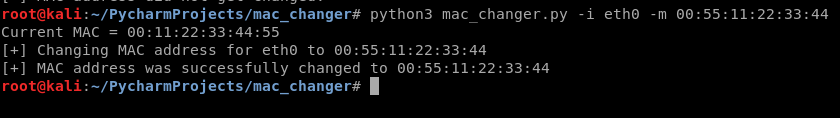

# mac changer
> This project was created to change MAC address on Linux in easy way. Just give interface and new MAC and it is done.

## Technologies
* Python 3.7
### Libraries
* subprocess
* optparse
* re

## Setup
To run this program you have to run mac_changer.py and give interface and mac.

 

To get help add --help to terminal.
